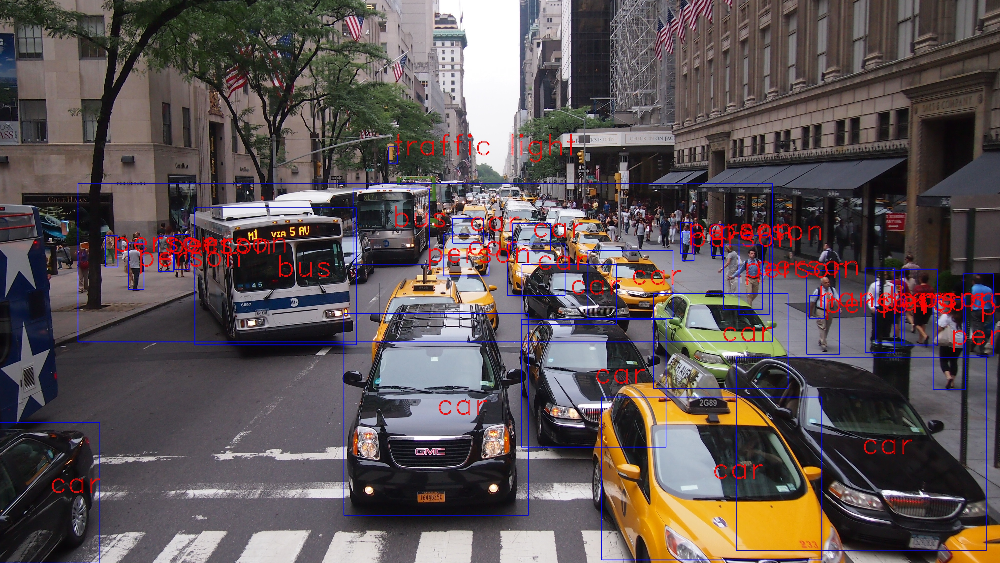

# YOLO3-4-Py
[](https://pypi.org/project/yolo34py)
[](https://pypi.org/project/yolo34py-gpu)
[](https://travis-ci.org/madhawav/YOLO3-4-Py)

A Python wrapper on [Darknet](https://github.com/pjreddie/darknet). Compatible with latest [YOLO V3](https://pjreddie.com/darknet/yolo).
YOLO 3.0 is an Object Detector by [pjreddie](https://pjreddie.com/).


Image source: http://absfreepic.com/free-photos/download/crowded-cars-on-street-4032x2272_48736.html

## Google Colab Demo
Refer the following link to preview YOLO3-4-Py in Google Colab: [[Google Colab](https://colab.research.google.com/drive/1DGzgpb8VR69EqSEb3bco6nSZQ_59eUZf?usp=sharing)]. 

Copy the notebook to your drive and run all cells. Ensure that you are in a GPU runtime. You can change the runtime by accessing the menu __Runtime__/__Change runtime type__.
## What's New?
* 2021-02-27 - Fixed the pkg-config related issue affecting some users of Ubuntu 20.04 and later.
* 2020-06-18 - Added a sample Google Colab notebook demonstrating functionality.
* 2019-01-15 - Added nvidia-docker support.
* 2018-08-04 - Option to select the preferred GPU - `pydarknet.set_cuda_device(GPU_INDEX)`
* 2018-04-23 - [PyPI Release of RC12](https://pypi.org/project/yolo34py-gpu)

## Pre-requisites
1) Python 3.5+
2) Python3-Dev (For Ubuntu, `sudo apt-get install python3-dev`)
3) Numpy `pip3 install numpy`
4) Cython `pip3 install cython`
5) Optionally, OpenCV 3.x with Python bindings. (Tested on OpenCV 3.4.0)
    - You can use [this script](tools/install_opencv34.sh) to automate Open CV 3.4 installation (Tested on Ubuntu 16.04).
    - Performance of this approach is better than not using OpenCV.
    - Installations from PyPI distributions does not use OpenCV.
```
NOTE: OpenCV 3.4.1 has a bug which causes Darknet to fail. Therefore this wrapper would not work with OpenCV 3.4.1.
More details are available at https://github.com/pjreddie/darknet/issues/502
```

## Installation
Installation from PyPI distribution (as described below) is the most convenient approach if you intend to use yolo34py for your projects.

### Installation of CPU Only Version
```bash
python3 -m pip install yolo34py
```

### Installation of GPU Accelerated Version
```bash
python3 -m pip install yolo34py-gpu
```

```
NOTE: PyPI Deployments does not use OpenCV due to complexity involved in installation. 
To get best performance, it is recommended to install from source with OpenCV enabled.
```
```
NOTE: Make sure CUDA_HOME environment variable is set.
```

## How to run demos in local machine?
1) If you have not installed already, run `python3 setup.py build_ext --inplace` to install library locally.
2) Download "yolov3" model file and config files using `sh download_models.sh`.
3) Run `python3 webcam_demo.py`, `python3 video_demo.py` or `python3 image_demo.py`

## How to run demo using docker?
1) Navigate to [docker](/docker) directory.
2) Copy sample images into the `input` directory. Or else run [input/download_sample_images.sh](docker/input/download_sample_images.sh)
3) Run `sh run.sh` or `sh run-gpu.sh`
4) Observe the outputs generated in `output` directory.
```
GPU Version requires nvidia-docker
```

## Installation from Source
1) Set environment variables
 - To enable GPU acceleration, `export GPU=1`.
 - To enable OpenCV, `export OPENCV=1`
 
2) Navigate to `./src` and run `pip3 install .` to install library.

### Using a custom version of Darknet
1) Set environment variable DARKNET_HOME to download location of darknet.
2) Add DARKNET_HOME to LD_LIBRARY_PATH. `export LD_LIBRARY_PATH=$LD_LIBRARY_PATH:$DARKNET_HOME`
3) Continue instructions for _installation from source_.

## Having trouble? 
Kindly raise your issues in the issues section of GitHub repository.

## Like to contribute?
Feel free to send PRs or discuss on possible future improvements in issues section. 
Your contributions are most welcome!

## Looking for YOLO v4?
https://github.com/AlexeyAB/darknet
